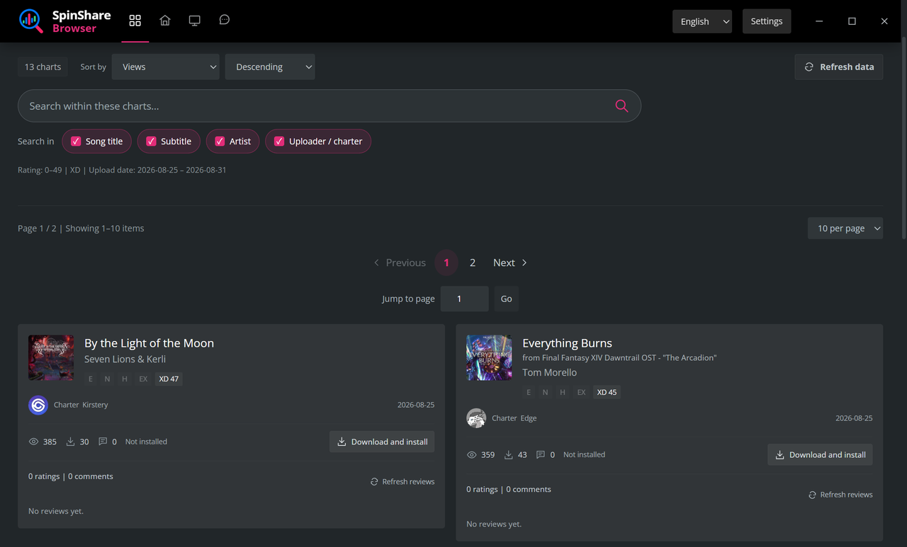
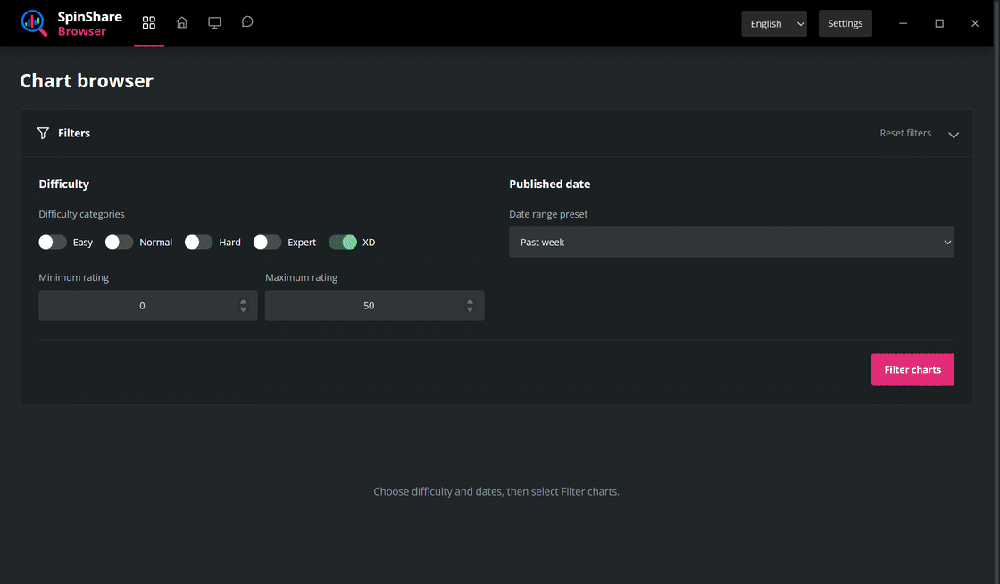

# SpinShare Browser

**English** | [简体中文](README.zh-CN.md)

A third-party Windows app for browsing and installing [SpinShare](https://spinsha.re/) charts.

## Features

- Filter by difficulty and upload date.
- Search the filtered charts by title, subtitle, artist, or uploader / charter.
- Combine independent tag filters, with result counts for each suggestion and a sticky selected-tag bar.
- Show all charts, only installed charts, or only uninstalled charts using locally verified installation status.
- Sort by upload date, difficulty rating, views, downloads, or title.
- Play a chart's complete song in one global header player.
- Browse cover art, author notes and tags, optionally show full comments, install charts, and check their installation status.
- English and Simplified Chinese interface.

## Install

**[Download for Windows](https://github.com/a3ho/SpinShareBrowser/releases/latest)**

1. On the release page, download `SpinShareBrowser-2.0.0-windows-x64-setup.exe` under **Assets**. Source archives are for building the app.
2. Run the installer and follow Setup. It installs for your Windows account, adds a Start Menu entry, and offers a desktop shortcut.

Requires **Windows 10 version 1903 or later, or Windows 11 (x64)**, and **.NET Framework 4.8 or later**. Python and the app libraries are bundled.

Setup reuses an existing **Microsoft Edge WebView2 Runtime 123.0.2420.47 or later**. If the runtime is missing or older, the bundled Microsoft bootstrapper downloads and installs it. A failed download can be retried in Setup; for offline installation, install Microsoft's [Evergreen Standalone Runtime](https://learn.microsoft.com/en-us/microsoft-edge/webview2/concepts/distribution) first. Browsing SpinShare requires internet access. WebView2 includes Microsoft Defender SmartScreen; see [Microsoft's privacy statement](https://aka.ms/privacy).

## Use

1. Choose the difficulty and upload date, then select **Filter charts**. Defaults are **XD, 0–99** and **Past week**. Custom date ranges accept a start date, an end date, or both.
2. Search within the results using the box below the filters. Select one or more search fields: song title, subtitle, artist, or uploader / charter.
3. Select **Download and install**. Before the first chart installation, review the complete current folder in the confirmation panel. Choose **Confirm and continue** when it is correct, or use the adjacent **Change directory** action; cancelling does not start a download. The confirmation is saved after success and is not shown again. Charts normally go into Spin Rhythm XD's `Custom` directory, and the folder can still be changed later in Settings.

**Installing a chart overwrites files with the same name.** The **Installed** label means the local chart file matches the listed version. DLC charts open SpinShare in your default browser for authorization and download.

Pages contain **10, 20, or 30** charts. **Unlimited** adds more as you scroll. You can jump to a page directly. Filtering, text search, tags, sorting, and paging always read the local catalog and never send another full-catalog request. Updating the catalog does not clear those search choices.

The result toolbar shows all installation states by default. After the first filter, you can choose only installed or only uninstalled charts. This combines with difficulty, date, keyword search scopes, AND tags, and sorting without resetting those choices. It checks the entire candidate set, not just the current page, through the local `/v1/installations/check` API and does not trigger another full refresh from SpinShare. Unknown or failed checks remain unconfirmed and are not treated as uninstalled.

Use **Add tag** to choose a suggestion or enter a complete tag and press Enter. Clicking a chart's tag also adds it. Tags are case-insensitive and must all match; changing other search criteria keeps them selected. Use a tag's ×, **Clear tags**, or **Reset filters** to remove them. Tag search becomes available after the first filter.

Hover or focus a chart cover to reveal its play control; clicking it starts that chart in the single header player. The song title remains selectable, copyable text. A separate subdued external-link icon beside it opens the official chart page. The header player shows a larger cover, song and artist, elapsed and total time, and a draggable progress bar without difficulty badges. With a current song, Space pauses or resumes it and Left / Right seek backward or forward by 5 seconds; editing and controls with their own keyboard behavior keep priority. With no current song, these keys keep their normal behavior and never start the hovered chart. The first click on a play control shows a one-time hint for these shortcuts.

The player uses the complete chart audio and its actual media duration; it does not impose an artificial preview limit. The app constructs only the fixed SpinShare CDN audio path from a strictly validated `fileReference`; playback does not call chart-detail, download, or counting APIs. It tries OGG, falls back to MP3 once, and gives each format a 15-second loading limit. Filtering, tags, sorting and paging keep the current song. A catalog update discards it if the media identity changed. Hiding or minimizing the app pauses without resuming automatically; quitting releases the media. Player changes use short motion and two cover layers for a clean crossfade, while reduced-motion settings remove spatial effects.

Author notes are not searched and never use an internal preview scrollbar. Short notes appear in full, keep their normal links and have no glow or expand action. Long previews keep half of an actual text line fully visible, then use 3px of extra space for the ending fade. Hovering, keyboard focus or an expanded note raises the text and solid preview surface by 2px over soft background light; the hit area stays still. Hover does not add a bright outline, and keyboard focus keeps an edge cue. Reduced motion removes the movement. Hover never opens the text: click, Enter or Space makes the same notes panel grow downward into a floating card while its top, left and right edges remain anchored to the original notes region.

The expanded card shows the same full text without adding a song name, heading or top-right close button. It may cover the tags and bottom actions, but it does not resize the chart card or move later cards. Text selection, copying and safe links are enabled only after expansion, using already loaded content without another server request. Click or activate the same region again, press Escape, or move the pointer outside the floating card to shrink it along the same path. While the pointer remains inside, ordinary wheel input scrolls only the note body and never leaks to the outer page, even at an edge or when the text is short. Tags keep their normal document position and do not open the notes; hover, keyboard focus or a tap can still reveal all tags.

Reviews are collapsed by default, but their counts load in the background for the current page or rendered batches in Unlimited mode, with at most two requests at a time and visible or open cards prioritized. Counts are cached independently of the displayed review content; closing reviews does not cancel the count request. A failed refresh keeps a previously known count, or shows a retryable unknown state. An unknown count is never shown as 0.

A confirmed total of 0 keeps the same comment-button shape, but the control is disabled with no arrow or hover highlight and is skipped by **Expand all reviews**; entries containing only ratings still open normally. If a response confirms zero after opening, the panel closes and clears old content; focus inside the reviews or on its button returns to the card title without scrolling.

Manual **Refresh reviews** actions share a cooldown of at least **60 seconds** across all charts, including failed attempts. All refresh buttons show the same countdown. Initial count loading and opening cached reviews neither use nor wait for this cooldown; manual refreshes still use the existing request queue. A timestamp in same-origin localStorage preserves the remaining time across page reloads. This is a frontend limit, not a backend guarantee across different ports or independent app processes.

Click a card's comment-count button to open its full reviews in a floating panel. Only one temporary panel is open at a time. It stays near the button on wider windows. On narrow windows, it extends toward the bottom while keeping a short pointer path from the button and staying below the header. Using the wheel anywhere inside the panel—including its title, summary, blank space or text—scrolls only the review list; reaching either end, or viewing short content, never scrolls the outer page. Ctrl+wheel and the inline review view keep their default behavior. A lightly dimmed background and panel depth keep attention on the reviews, with a 220ms opening / 150ms closing rhythm and no movement while reading; reduced motion disables translation and scaling. Opening, loading and closing do not change page height, move the cards below or lock page scrolling. There is no top-right close button: move the pointer outside both the source card and panel, click the count again, press Escape, click outside or change pages to close it; restoring focus does not scroll the page.

**Expand all reviews** is off by default. Turning it on displays full reviews inside each card and keeps them open when the pointer leaves; turning it off restores floating panels. Position, background and layering distinguish the two presentations, without mode labels. Review content remains fully accessible without truncation. Review timestamps omit timezone suffixes such as “· Europe/Berlin”; date conversion is unchanged.

<!-- Superseded review behavior: temporary inline drawers used height animations that moved following cards, showed temporary/pinned mode labels, and loaded counts only when opened. The background counts and floating panels above replace those rules; the global expanded view remains inline. -->

The full catalog and separate foreground/background refresh state are saved in `charts-cache.json`, normally under `%LOCALAPPDATA%\SpinShareBrowser`, independently of the program and chart installation folders. A normal quit keeps them. With no local catalog, or when the last successful update is more than **12 hours** old, the app synchronizes automatically. Startup shows a centered focus panel with the real transfer stage and bytes received; while the app remains open, the same work runs as one low-priority background task. Filtering itself remains local.

Automatic synchronization does not consume the foreground manual-update interval. Automatic failures use their own persisted 5-minute, 15-minute, 1-hour, then 6-hour backoff, while an explicit user retry bypasses that automatic backoff. Manual **Update data** requests still reserve a persistent **10-minute** cooldown before a request that may use server resources. A confirmed 401/403 access rejection rolls it back; rate limits, server failures, waits, interruptions, timeouts, oversized or invalid responses, and failed final saves retain it across restarts.

If startup synchronization fails with an old catalog, choose **Retry** or **Use local data**; with no catalog, retry or exit. Errors distinguish network, access, rate-limit, server, transfer, response, and local-storage failures. In the tray, a real update or failure uses a custom no-focus notice at the lower right and fades away; an unchanged catalog stays quiet. A new catalog invalidates derived caches while preserving search choices. Catalog synchronization uses the search API, not the view-counting song detail endpoint; manually opening a website link follows the site's counting rules.

<!-- Superseded catalog behavior: filtering or Refresh list previously decided whether to contact the server. Filtering is now strictly local; 12-hour automatic synchronization and foreground Update data are managed separately. The 60-second manual review cooldown is unchanged. -->

The install queue holds up to **128 active or waiting tasks**, with up to **2 chart downloads** at a time. Completed downloads are installed one at a time, allowing downloads to overlap installation while keeping file replacement and rollback serialized. Prefetching is bounded rather than downloading the entire waiting queue. ZIP integrity is checked while staging files, and every file must pass before existing files are replaced, avoiding duplicate decompression. A full queue asks you to wait for a task to finish, not to change the install folder.

Each chart uses one official download request; the current ZIP endpoint is not repeatedly requested for parallel segments. Actual speed still depends on server ZIP generation, network and disk performance, so full bandwidth cannot be guaranteed in every environment.

Closing the window asks whether to quit or minimize to the system tray. Select **Remember my choice**, or change the behavior in Settings. While resident in the tray, a catalog older than 12 hours synchronizes without taking focus or running concurrent retries; fullscreen, battery-saver, or metered-network use defers it. **Quit app** in Settings or the tray exits the program; active downloads and installations can finish before exit.

Language, the chart directory, close preferences, and window size or maximized state are saved automatically. The first launch opens maximized.

## Upgrade and uninstall

Running Setup again states on its Welcome page that it will overwrite and update the installed SpinShare Browser while keeping its settings. Locally installed charts remain unchanged. Uninstall through **Windows Settings → Apps** or **Control Panel → Programs and Features**. Uninstalling removes the app, its settings, and its cache. Downloaded and installed charts and the shared WebView2 Runtime are kept.

The default installation folder is `%LOCALAPPDATA%\Programs\SpinShareBrowser`; settings and embedded browser data use `%LOCALAPPDATA%\SpinShareBrowser`. Charts stay in the selected game directory.

## License

Original code is licensed under [MIT](LICENSE). Third-party components and artwork retain their own licenses; see [third-party notices](licenses/) and [artwork attribution](assets/README.md).

[Build from source](docs/build.md)

Developed by Liu Yishou\n