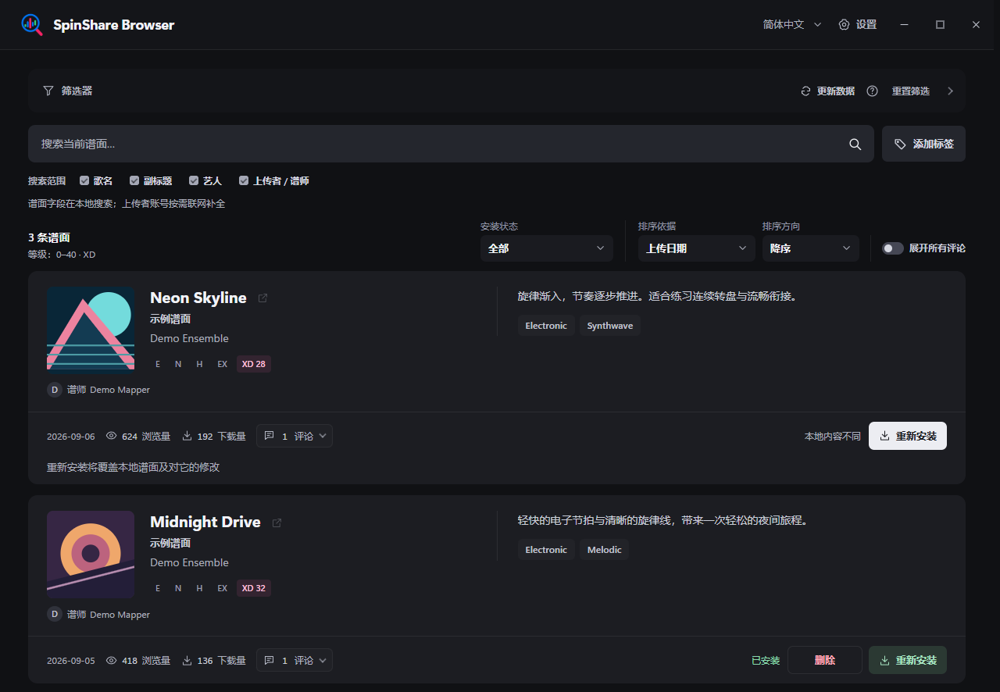
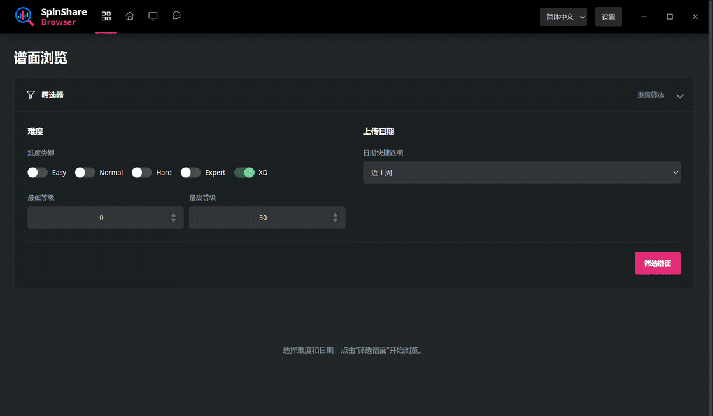

# SpinShare Browser

[English](README.md) | **简体中文**

用于浏览和安装 [SpinShare](https://spinsha.re/) 谱面的第三方 Windows 工具。

## 功能

- 按难度和上传日期筛选谱面。
- 在筛选结果内按歌名、副标题、艺人或上传者 / 谱师搜索。
- 独立叠加标签筛选，候选显示追加该标签后的结果数；已选标签栏随滚动吸顶。
- 根据本地核对的安装状态，显示全部谱面、仅已安装或仅未安装的谱面。
- 按上传日期、难度等级、浏览量、下载量或歌名排序。
- 在顶栏唯一的全局播放器中播放谱面的完整歌曲。
- 查看封面、作者说明和标签，按需显示完整评论，下载并安装谱面，识别安装状态。
- 支持简体中文和 English 界面。

## 安装

**[下载 Windows 安装包](https://github.com/a3ho/SpinShareBrowser/releases/latest)**

1. 在发布页的 **Assets** 中下载 `SpinShareBrowser-2.0.0-windows-x64-setup.exe`。源码包供自行构建使用。
2. 运行安装包，按向导完成安装。程序为当前 Windows 用户安装，创建开始菜单入口，并提供桌面快捷方式选项。

需要 **Windows 10 1903 或更高版本、Windows 11（x64）**，以及 **.NET Framework 4.8 或更高版本**。安装包包含 Python 和程序所需的库。

安装程序会复用已有的 **Microsoft Edge WebView2 Runtime 123.0.2420.47 或更高版本**。缺少或版本较旧时，通过随包附带的微软引导程序联网下载安装；下载失败可重试。需要离线安装时，请先安装微软 [Evergreen 独立运行时](https://learn.microsoft.com/en-us/microsoft-edge/webview2/concepts/distribution)。浏览 SpinShare 需要联网。WebView2 包含 Microsoft Defender SmartScreen，数据处理方式见[微软隐私声明](https://aka.ms/privacy)。

## 使用

1. 选择难度和上传日期，点击“筛选谱面”。默认值为 **XD、0–99** 和 **近 1 周**。自定义日期可只填写开始日期、只填写结束日期，或同时填写两端。
2. 使用筛选器下方的搜索框搜索当前结果。“搜索范围”可选择一项或多项：歌名、副标题、艺人、上传者 / 谱师。
3. 点击“下载并安装”。首次安装谱面前，确认卡片会完整显示当前目录；目录正确时点击“确认并继续”，不正确时使用旁边的“修改目录”，取消不会开始下载。确认成功后会记住选择，后续不再询问；谱面默认安装到 Spin Rhythm XD 的 `Custom` 目录，之后仍可在设置中更改。

**安装会覆盖同名文件。** “已安装”表示本地谱面文件与列表中的版本一致。DLC 谱面在系统默认浏览器中打开 SpinShare 官网，完成授权和下载。

每页可选 **10 条、20 条或 30 条**，也可跳转到指定页码；选择“不限制”后，向下滚动会分批显示更多谱面。筛选、文字、标签、排序和翻页始终读取本地目录，不会另发全量目录请求；目录更新本身也不清空这些搜索选择。

结果工具栏中的安装状态默认“全部”；首次筛选完成后，可选“仅已安装”或“仅未安装”。它与难度、日期、关键词搜索范围、AND 标签和排序组合，改变一项不会重置其它项。筛选通过本地 `/v1/installations/check` 核对整个候选集合，而不只检查当前页，不会额外触发 SpinShare 全量刷新。状态未知或核对失败会保留为未确认，不会冒充“未安装”。

点击“添加标签”选择候选，或输入完整标签后按回车；也可以点击谱面上的标签。标签不区分大小写，多个标签必须同时匹配，修改其它搜索条件不会清除它们。点击标签的 × 或“清空标签”取消限制。“重置筛选”也会清除标签。首次筛选前不能使用标签搜索。

鼠标悬停或键盘聚焦谱面封面时会显示播放按钮，点击后由顶栏唯一的全局播放器播放该谱面的完整歌曲。歌名保留为可选择、复制的普通文本，旁边独立、低调的外链图标用于打开官网谱面页。顶栏播放器显示较大封面、歌名与艺人、当前和总时间及可拖动进度条，不显示难度标签。已有曲目时，Space 可全局切换播放 / 暂停，左右方向键分别后退 / 快进 5 秒；正在编辑或使用具有原生键盘行为的控件时让出快捷键。没有当前曲目时，这些按键保持原有行为，不会根据悬停谱面自动开始播放。首次点击播放时，程序会用一次性提示说明这些快捷键。

播放器使用谱面包中的完整歌曲音频及媒体实际时长，不再人为截断为试听片段。程序只把严格校验后的 `fileReference` 拼接到固定的 SpinShare CDN 音频路径，播放不会访问曲目详情、下载或其它计数接口。播放器先尝试 OGG，失败后只回退一次 MP3，每种格式的加载上限为 15 秒。筛选、标签、排序和翻页会保留当前曲目；目录更新发现媒体身份变化时才清理。隐藏或最小化程序会暂停，恢复可见后不自动续播；完全退出时释放媒体。曲目切换使用统一短动效和双封面交叉淡化，减少运动偏好会取消空间位移和缩放。

作者说明不参与搜索，也不在折叠预览中使用内嵌滚动条。短说明完整显示，原生链接可用，没有光晕或展开操作；长预览完整露出实际文字的半行，再用额外 3px 做末端渐隐，避免把半行主体遮淡得难以辨认。悬停、键盘聚焦或展开期间，文字与实体预览表面抬升 2px，背后呈现扩散柔光，外部命中区域保持不动。普通悬停没有亮色轮廓，键盘保留边缘焦点提示；减少运动时取消位移。绝不悬停自动展开：点击、Enter 或 Space 会让同一个说明面板保持卡片右侧原区域的顶部和左右锚点，向下长成浮动卡片。

展开后的浮动卡片只显示同一份全文正文，不添加可见歌名、标题或右上关闭键。它可以覆盖标签和卡片底部操作，但不会增高谱面卡片或推移后续卡片。文字选择、复制和安全链接只在展开后启用，全文复用已加载内容，不新增服务器请求。再次点击或键盘确认、按 Escape、指针移出浮动卡片时沿原路径缩回；指针位于卡片内时，普通滚轮只滚动说明正文，到达边界或内容较短时也不带动外页，移出后才恢复外页滚动。标签保留在原文档位置且不触发说明展开；悬停、键盘聚焦或触摸仍可查看全部标签。

评论默认全部收起，但数量会在当前整页或“不限制”模式已渲染的批次中后台加载，同时最多处理两项请求，优先处理可见或正在阅读的卡片。数量缓存与评论全文的显示独立，关闭评论不取消计数。刷新失败时保留已知数量，没有已知数量时显示可重试的未知状态，不会用 0 代替未知数量。

已确认总数为 0 时仍保留统一的评论按钮外形，但不可展开、无箭头或悬停高亮，“展开所有评论”也会跳过；有条目的纯评分仍可展开。若打开后才确认 0，会关闭并清除旧正文；焦点原在评论区域或数量按钮时回到本卡标题，不滚动页面。

所有谱面的手动“更新评论”共用至少 **60 秒**冷却，失败也计入，各更新按钮显示同一倒计时。首次加载数量和打开缓存既不占用、也不必等待这段冷却；手动刷新仍使用现有请求队列。时间戳保存在同源 localStorage，刷新页面会保留剩余时间。这是前端限制，不是不同端口或独立程序进程之间的后端强制限流保证。

点击卡片统计中的评论数量按钮，可在浮层中阅读完整评论，每次只打开一个临时浮层。宽窗中浮层靠近按钮，窄窗中延伸至近视口底部，上沿避开顶栏并兼顾按钮位置，保持鼠标可达。在浮层内任意位置使用普通滚轮，包括标题、摘要、空白或正文，都只滚动内部评论列表；到顶、到底或内容较短时也不会带动外层页面，Ctrl+滚轮和全局内嵌评论仍保留原有行为。轻度背景压暗与浮层深度让注意力集中在评论上，采用 220ms 进入、150ms 退出节奏，阅读期间停稳，减少运动时不做平移和缩放。打开、加载和收起均不改变页面高度、不推移下方卡片，也不锁定页面滚动。不设右上关闭键；移开来源卡片和浮层、再次点击数量按钮、按 Escape、点击外部或换页均可收起，焦点返回不触发页面滚动。

“展开所有评论”默认关闭；开启后完整评论内嵌于每张卡片，不随鼠标离开收起，关闭后恢复按需浮层。两种呈现仅用位置、背景和层级区分，不显示模式文字标识。评论全文始终可达，不截断。评论时间不再显示“· Europe/Berlin”等时区尾缀，日期换算保持不变。

<!-- Superseded：先前临时内嵌抽屉通过高度动画推移后续卡片，并显示临时/常驻模式文字，数量在打开后才加载。上面的后台计数与浮层规则已覆盖旧方案；全局展开仍内嵌。 -->

全量目录及前台、后台更新时间保存在 `charts-cache.json`，默认位于 `%LOCALAPPDATA%\SpinShareBrowser`，与程序安装目录和谱面目录独立，正常完全退出后保留。没有本地目录，或最近一次成功更新已超过 **12 小时**时，程序会自动同步：启动时以中央聚焦卡片显示真实阶段和已接收数据量，运行中则以低优先级在后台完成。筛选操作只读本地数据。

自动同步不占用前台手动更新的十分钟额度；自动失败采用独立的 5 分钟、15 分钟、1 小时、6 小时退避，但用户主动重试不受自动退避限制。手动“更新数据”仍遵守至少 **10 分钟**的前台冷却，失败和重启不能绕过。服务会在可能使用服务器资源的手动请求前保存冷却，新目录先原子写入本地文件，再提供给界面。

启动同步失败但有旧目录时，可选择“重试”或“使用本地数据”；没有目录时可重试或退出。错误会区分网络、访问拒绝、限流、服务器、传输、数据格式和本地存储问题。托盘后台实际更新或失败时，右下角会出现不抢焦点的轻提示并柔和消失；数据没有变化时保持安静。自动目录查询仍使用搜索接口，不访问会增加浏览量的曲目详情页；手动打开官网链接仍遵循官网的计数规则。

<!-- Superseded：先前由筛选或“刷新列表”隐式决定是否联网；当前筛选严格读取本地目录，12 小时自动同步与前台“更新数据”分别管理。评论手动刷新的 60 秒倒计时不受影响。 -->

安装队列最多容纳 **128 项正在处理或等待的任务**，同时下载最多 **2 个谱面**，下载完成后依次校验和安装。下载与安装可以同时推进，但文件替换与回滚仍串行执行。预取数量有界，不会一次下载整个等待队列。ZIP 在写入临时文件时完成完整性校验，全部文件通过后才替换旧文件，避免重复解压。队列已满时会提示等待任务完成，不会提示修改安装目录。

单个谱面使用一次官方下载请求，不对当前官网的 ZIP 接口重复分段请求。最终速度仍取决于官网生成 ZIP 的耗时、网络和磁盘，不能保证所有环境下都达到带宽上限。

关闭窗口时会询问“完全退出”或“最小化到系统托盘”。勾选“记住我的选择”后保存偏好，也可在设置中更改。托盘常驻时，超过 12 小时的目录会在不抢焦点、不并发重试的后台任务中同步；全屏、省电或按流量计费环境会延后。设置和托盘中的“完全退出”会退出程序；下载或安装期间可选择等待当前任务完成后退出。

语言、谱面目录、关闭偏好、窗口大小或最大化状态会自动保存。首次启动以最大化窗口打开。

## 升级与卸载

再次运行安装包时，欢迎页会明确说明将以覆盖更新方式替换已安装的 SpinShare Browser 并保留设置；本地已安装谱面不受影响。通过 Windows“设置 → 应用”或控制面板“程序和功能”卸载。卸载会删除工具及其设置、缓存等本地数据，保留下载或安装的谱面以及共享 WebView2 运行时。

程序默认安装到 `%LOCALAPPDATA%\Programs\SpinShareBrowser`，设置和内嵌浏览器数据存放在 `%LOCALAPPDATA%\SpinShareBrowser`，谱面存放在所选游戏目录中。

## 许可证

原创代码采用 [MIT 许可证](LICENSE)。第三方组件与美术资源遵循各自的许可证，详见[第三方许可声明](licenses/)和[美术资源署名](assets/README.zh-CN.md)。

[从源码构建](docs/build.zh-CN.md)

Developed by Liu Yishou\n